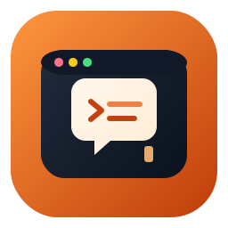

<p align="center">
	
</p>

<h1 align="center">mini-claude-code</h1>

<p align="center">
	一个用于学习 AI Agent 架构的 Python 项目。<br/>
	目标是用最小可读实现复刻「带工具调用的终端助手」核心流程。
</p>

<p align="center">
	<a href="https://github.com/li-dashan/mini-claude-code/actions/workflows/ci.yml"></a>
	<a href="https://github.com/li-dashan/mini-claude-code/releases"></a>
	<a href="https://github.com/li-dashan/mini-claude-code/commits/main"></a>
	<a href="https://github.com/li-dashan/mini-claude-code/blob/main/LICENSE"></a>
	
	
</p>

## 特性亮点

- 双 Provider：支持 Anthropic / OpenAI，统一走 `LLMProvider` 抽象层
- Agentic Loop：流式输出 + 工具调用 + 多轮迭代
- 多工具系统：`bash` / `read_file` / `write_file` / `glob`
- 两套终端体验：`simple`（Rich REPL）与 `tui`（Textual 界面）
- 可读性导向：代码结构清晰，适合学习和二次改造

## 快速开始

### 1. 安装

方式 1（推荐，uv）：

```bash
uv venv
source .venv/bin/activate
uv pip install -e .
```

方式 2（pip）：

```bash
python -m venv .venv
source .venv/bin/activate
pip install -e .
```

### 2. 配置环境变量

```bash
cp .env.example .env
```

至少配置以下变量之一：

- `ANTHROPIC_API_KEY`（当 `LLM_PROVIDER=anthropic`）
- `OPENAI_API_KEY`（当 `LLM_PROVIDER=openai`）

常用配置：

```env
LLM_PROVIDER=anthropic
ANTHROPIC_MODEL=claude-sonnet-4-5-20251022
OPENAI_MODEL=gpt-4o
MAX_ITERATIONS=10
WORK_DIR=.
UI_MODE=simple
```

说明：

- `UI_MODE=tui` 时启动 Textual TUI
- 默认 `UI_MODE=simple` 为 Rich REPL

### 3. 运行

```bash
mini-claude
```

或：

```bash
python -m mini_claude.main
```

## 交互命令

- `/exit`：退出
- `/clear`：清空上下文历史
- `/history`：显示当前上下文估算 token 数

## Agentic Loop 核心

`QueryEngine.run()` 关键流程：

1. 记录用户输入到上下文
2. 流式调用 LLM 并实时输出文本
3. 收集工具调用请求
4. 并发执行工具并写回结果
5. 在 `max_iterations` 内循环，直到模型结束当前回合

该结构支持一个回合内的「思考 -> 调工具 -> 再思考」迭代。

## 项目结构

```text
src/mini_claude/
	main.py                  # 程序入口，组装 Provider / Tool / UI
	core/
		context_manager.py     # 上下文与消息管理
		query_engine.py        # Agentic Loop 核心
		types.py               # 全局类型定义
	llm/
		provider.py            # LLM 抽象接口
		anthropic_provider.py  # Anthropic 实现
		openai_provider.py     # OpenAI 实现
	tools/
		base.py                # Tool 抽象基类
		registry.py            # 工具注册与调度
		bash.py                # Bash 执行
		read_file.py           # 文件读取
		write_file.py          # 文件写入
		glob_tool.py           # Glob 搜索
	ui/
		simple_repl.py         # Rich 终端 REPL
		tui/
			app.py               # Textual TUI
```

## 开发

安装开发依赖：

```bash
pip install -e .[dev]
```

类型检查：

```bash
mypy src
```

测试：

```bash
pytest
```

## 自动化 Release

本项目已接入基于 GitHub Actions 的自动化 Release：

- `Release Please`：监听 `main`，自动生成/更新 Release PR（版本号 + CHANGELOG）
- `Release Publish`：当 GitHub Release 发布后，自动构建 `dist/*` 并上传到 release assets

工作流文件：

- `.github/workflows/release-please.yml`
- `.github/workflows/release-publish.yml`

如果遇到 `GitHub Actions is not permitted to create or approve pull requests`：

- 到仓库 `Settings -> Actions -> General -> Workflow permissions`
- 开启 `Read and write permissions`
- 勾选 `Allow GitHub Actions to create and approve pull requests`
- 可选：配置 `RELEASE_PLEASE_TOKEN`（PAT，`repo` 权限）以避免受默认 `GITHUB_TOKEN` 限制

建议使用 Conventional Commits：

- `feat:` -> minor
- `fix:` -> patch
- `feat!:` 或 `BREAKING CHANGE:` -> major

## 许可证

本项目使用 MIT License，详见 `LICENSE` 文件。